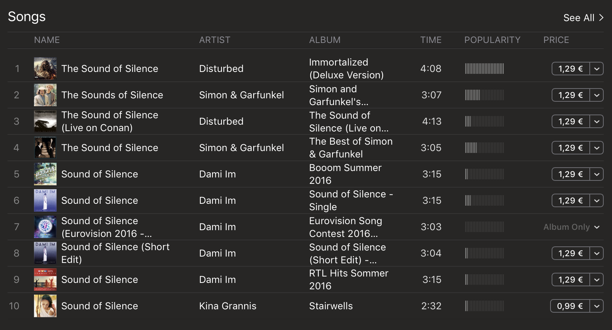

# The Sound of Silence 

Mach eine Vorschau für's Suchergebnis mit den Daten in `music.js` (schon verfügbar in der `music`-Variablen)

Für jedes Lied sollte angezeigt werden:
- Stück name
- Künstler name
- Bild
- Erscheinungsdatum
- Preis und Währung

- Die Seite sollte so aufgebaut sein, muss aber nicht genau so aussehen:

